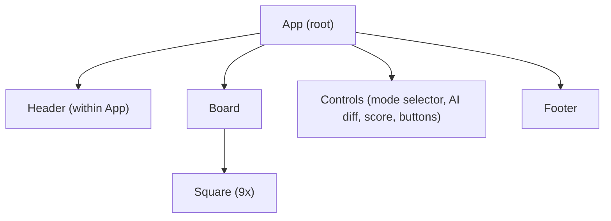
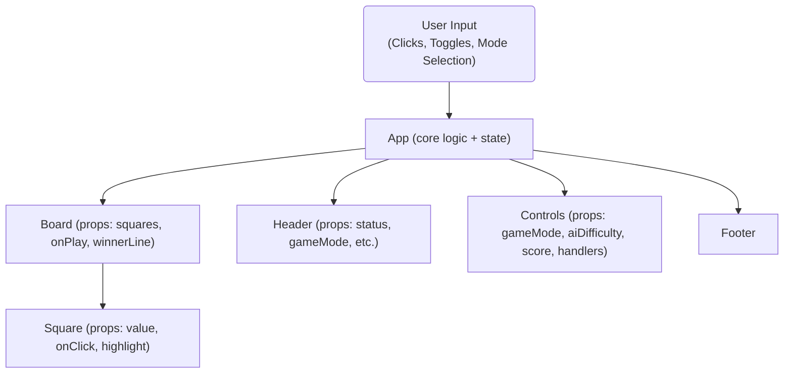

# tic_tac_toe_frontend Architecture Documentation

## Overview

The Tic Tac Toe project frontend is a single-page React application for playing Tic Tac Toe in the browser, featuring three modes: Local Two-Player, AI Opponent, and Real-Time Multiplayer (simulated). The app leverages function components, React State, and CSS modules to present a modern, responsive UI.

## Component Hierarchy

The application is relatively flat, with all logic centralized in the `App` component. Lower-level presentational components (`Board`, `Square`) are defined inline but serve as reusable visual units. The main hierarchy can be visualized as follows:



- **App**: (Main component) Contains all application state, game logic, and subcomponent rendering. Handles user interaction, game state, theme switching, and mode selection.
- **Header**: Includes theme toggle, game title, current status/winner, and real-time room info.
- **Board**: Renders a 3x3 grid of `Square` components; manages click handling and win highlighting.
- **Square**: Represents an individual cell of the game grid, propagates user clicks up to Board.
- **Controls**: Lets the user select Local/AI/Real-Time modes, choose AI difficulty, view scores, and reset/restart game.
- **Footer**: Displays copyright.

## UI and State Management

All critical application state is managed at the `App` level using React's `useState` and `useEffect` hooks:
- `theme`: Light/Dark mode styling for the application.
- `gameMode`: LOCAL_TWO_PLAYER, VERSUS_AI, or REALTIME (simulated).
- `squares`: The 3x3 board, as a flat array of 9 (X/O/null).
- `isXNext`: Boolean tracking whose move it is.
- `winner` / `winnerLine`: Tracks if a player has won and which line, for highlighting.
- `draw`: Boolean for draw state.
- `score`: Score counters for X, O, and Draw.
- `aiDifficulty`: 'easy' (random) or 'hard' (minimax AI).
- `realtimeRoom`, `mySymbol`, `realtimeStatus`: Used for simulated real-time play.
- `ws` (ref): Reference for a websocket, reserved for future real networking/real-time play.

### State and Data Flow

- All changes originate from user interaction (`onClick` on Square, mode/difficulty selectors, reset/restart buttons).
- State setters (via `useState`) trigger React re-renders; state is passed down as props to subcomponents.
- `Board` and `Square` are pure presentational components, delegating user actions up to `App`.
- Game status and outcome (whose turn, win/draw logic, scoreboard) are centrally computed in `App`.

### Diagram: High-Level State and Prop Flow



- All core state and logic is kept in App, and only UI props are passed to children.

## AI and Real-Time Feature Structure

### AI (Versus AI Mode)

- If "Vs AI" is selected, App switches the `gameMode` to VERSUS_AI.
- On each user move, a `useEffect` detects if it is the AI's turn:
    - If `aiDifficulty` is 'easy', it uses `aiMove()` to pick a random empty square.
    - If 'hard', it uses `minimax()` for perfect-play logic.
- The AI move is delayed (with `setTimeout`) for a smoother UX.
- After the AI moves, state is recalculated as usual (check for win/draw, advance turn).

### "Real-Time" Multiplayer (Simulated Room Mode)

- Selecting "Real-Time" game mode generates a random room code for the session, and the user is assigned the X symbol.
- The current implementation does not incorporate live networking: the "real-time" mode is a stub for future use, merely changing status messages and turn logic.
- State such as `realtimeRoom`, `mySymbol`, and `realtimeStatus` display simulated room/waiting info.
- `ws` ref (websocket) exists in code for possible future extension to real live multiplayer.

## Styling and UI

- All UI styling is handled in `App.css`, using CSS variables and modern responsive techniques.
- The Board and Scorecard use Flexbox and Grid for centered, scalable layout.
- Theme toggling is implemented via a top-level data attribute and variable overrides.

## Key Design Choices

- **Centralized State**: All state and logic flows from the `App` component. This eliminates prop drilling for this simple app and makes future refactoring for Redux or Context easy if scaling out.
- **Pure UI Subcomponents**: `Board` and `Square` do not maintain their own state, making UI consistent and easy to test.
- **Extendable Structure**: The simulated real-time setup and websocket ref are designed for future implementation of true multiplayer play with minimal restructuring.
- **Styling Simplicity**: No large UI frameworks are used—pure CSS with CSS variables creates a lightweight, brandable interface.

---

## Summary

The Tic Tac Toe frontend is intentionally simple, with all state and logic in a single root component, and minimal subcomponent complexity. It is built to be easily extended with real-time multiplayer features. The architecture emphasizes clarity, scalability, and modern React best practices.

```
Sources:
- src/App.js
- src/index.js
- src/App.css
```
